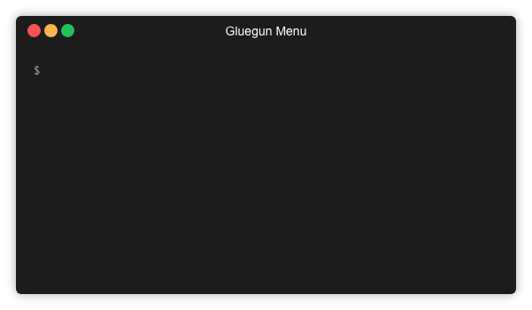

# Gluegun Menu

The Gluegun Menu is an extension for [Gluegun](https://infinitered.github.io/gluegun) CLIs.
It generates an interactive menu structure from the commands of the CLI.



The extension can be integrated into any Gluegun project.
It is already integrated in the [lenne.Tech CLI Starter](https://github.com/lenneTech/cli-starter),
which can be initialized comfortably via the [lenne.Tech CLI](https://github.com/lenneTech/cli).

## Integration

It can be easily integrated into your CLI:

### 1. Install extension:

```bash
$ npm install @lenne.tech/gluegun-menu
```

### 2. Integrate extension as plugin:

`src/cli.ts`:

```typescript
// ...
const cli = build()
  // ...
  .plugin(__dirname + '/../node_modules/@lenne.tech/gluegun-menu/dist', {
    commandFilePattern: '*.js',
    extensionFilePattern: '*.js'
  })
  // ...
  .create();
// ...
```

### 3. Prepare main commands

`src/commands/YOUR_COMMAND/YOUR_COMMAND.ts`:

```typescript
import { GluegunMenuToolbox } from '@lenne.tech/gluegun-menu';

/**
 * YOUR_COMMAND menu
 */
module.exports = {
  name: 'YOUR_COMMAND',
  alias: ['YOUR_COMMAND_ALIAS'],
  description: 'YOUR_DESCRIPTION',
  hidden: true,
  run: async (toolbox: GluegunMenuToolbox) => {
    await toolbox.menu.showMenu('(PARANT_COMMANDS) YOUR_COMMAND');
  }
};
```

## Parameters of `showMenu`

1. parentCommands?: string  
   command name OR parent names + command name

2. options?: object

   - level: number => Level of the current section (0 = main section)
   - headline: string => Headline for the current section

Note: If the options in the main menu are to be used, for example to define the headline,
`null` or an empty string `''` must be passed as the first parameter:  
`showMenu(null, {headline: 'Main menu'})`

## Example

Example file structure:

```
src/commands/
    section1/
        subsection1/
            subsection1.ts
            yyy1.ts
            yyy2.ts
        section1.ts
        xxx1.ts
        xxx2.ts
    section2/
        section2.ts
        zzz1.ts
        zzz2.ts
    brand.ts
```

`src/commands/brand.ts`:

```typescript
import { GluegunMenuToolbox } from '@lenne.tech/gluegun-menu';

/**
 * Main menu
 */
module.exports = {
  name: 'brand',
  description: 'Welcome to brand CLI',
  hidden: true,
  run: async (toolbox: GluegunMenuToolbox) => {
    await toolbox.menu.showMenu();
  }
};
```

`src/commands/section1/section1.ts`:

```typescript
import { GluegunMenuToolbox } from '@lenne.tech/gluegun-menu';

/**
 * Section1 menu
 */
module.exports = {
  name: 'section1',
  alias: ['s1'],
  description: 'Description for section1',
  hidden: true,
  run: async (toolbox: GluegunMenuToolbox) => {
    await toolbox.menu.showMenu('section1');
  }
};
```

`src/commands/section1/subsection1/subsection1.ts`:

```typescript
import { GluegunMenuToolbox } from '@lenne.tech/gluegun-menu';

/**
 * Subsection1 menu
 */
module.exports = {
  name: 'subsection1',
  alias: ['sub1'],
  description: 'Description for subsection1',
  hidden: true,
  run: async (toolbox: GluegunMenuToolbox) => {
    await toolbox.menu.showMenu('section1 subsection1', { headline: 'Subsection1 commands' });
  }
};
```

## Thanks

Many thanks to the developers of [Glugun](https://infinitered.github.io/gluegun)
and all the developers whose packages are used here.

## License

MIT - see LICENSE
